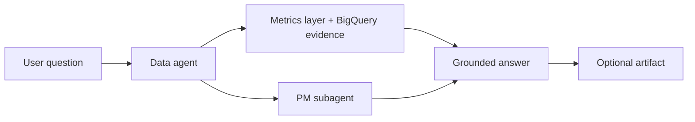
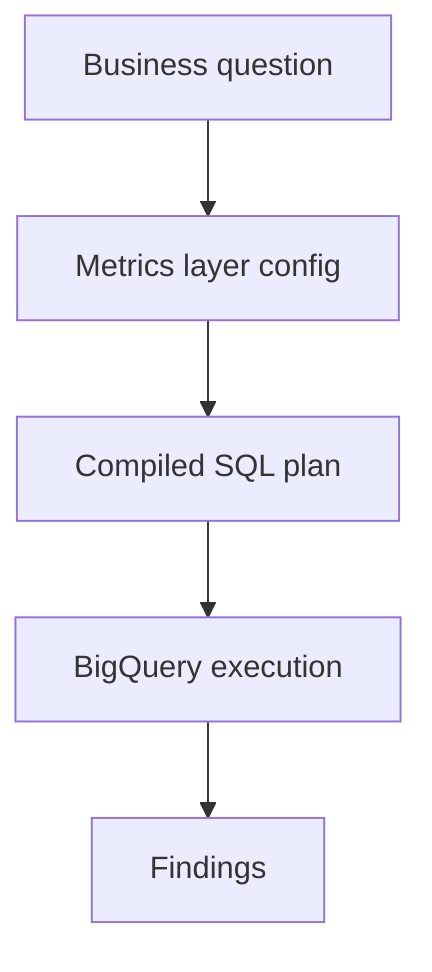

# Crew Agent

`crew` is a local agent workspace built on top of `mash`.
Its current product model is intentionally simple:

- `data` is the primary agent and main user entry point
- `pm` is a specialist subagent for product judgment
- `crew` CLI exposes both conversational workflows and direct command workflows

The goal is to help teams move from business questions to grounded answers, and from one-off answers to reusable collaborative artifacts and shared operating model. Current warehouse support is BigQuery.


## Two Ways To Use Crew

### Command Mode

Command mode is for direct, deterministic interactions with local product surfaces.
Instead of asking a free-form question, the user calls a specific CLI command.

Examples:

```bash
crew metrics list --dataset marketing
crew metrics show --dataset marketing --kind metric --name spend_total
crew metrics compile --dataset marketing --metric spend_total --dimension campaign_id

crew artifact list
crew artifact show launch_readout_q2
crew artifact search "launch readiness"
```

Use command mode when:

- the user knows exactly what they want to inspect
- the task is operational rather than conversational
- the user wants direct access to metric configs, compiled SQL, or saved artifacts

### Agent Mode

Agent mode is for free-form, conversational questions.
This is the right mode when the user wants `crew` to interpret the request, choose the right analytical path, and respond interactively.

`crew` is a focused two-agent system:

- `data`: analytics, metrics, SQL planning, evidence gathering, and first-pass stakeholder support
- `pm`: prioritization, roadmap framing, trade-off analysis, and recommendation support

Users begin with the `data` agent. When a question requires product judgment rather than just analysis, `crew` can bring in the `pm` subagent.



Examples:

```bash
crew agent repl --agent data
crew agent invoke --agent data "What changed in activation over the last 4 weeks?"
crew agent invoke --agent data "Turn this analysis into a short launch readout."
```

Use agent mode when:

- the question is open-ended
- the user wants analysis plus explanation
- the task may become a reusable artifact
- the data agent may need PM support for framing or recommendation

## Common questions

- "what changed in activation over the last 4 weeks?"
- "break down paid conversion by channel and campaign."
- "which step in the onboarding funnel is driving the largest drop-off?"
- "how did retention move for users acquired after the new launch?"
- "what metrics should we use to evaluate this launch?"
- "what metrics do we already have for the marketing dataset?"
- "create a metric for weekly activated users."
- "update the retention metric so it supports platform as a dimension."
- "add a source config for our new onboarding events table."
- "turn this analysis into a short launch readout I can share."
- "given these results, what should we prioritize next quarter?"

## Context and Memory

The `data` agent is not meant to answer from intuition alone.
It is grounded by four core product layers:

- the `metrics_layer` service
- the `artifacts` service
- the `data-analyst` and `data-steward` skills
- inbuilt `MemoryStore` layer provided by mash

Together, these give the agent a structured way to reason about business logic, reuse prior work, and keep analysis tied to durable definitions.

The memory layer is what preserves conversational context over time. Agent sessions are stored through the `MemoryStore` interface, which persists conversation turns, structured logs, signals, preferences, and app data for each session. In the current local setup, that memory is backed by SQLite, which gives the agent durable session history instead of treating every interaction as stateless.

## Metrics Layer

The `metrics_layer` is the semantic source of truth for metric and source definitions. It offers:

- stable source and metric configs
- schema-driven validation for metric authoring
- deterministic compilation from semantic metric definitions to executable SQL
- a clean contract between business logic and warehouse execution

This is what keeps the data agent grounded in config-defined business logic rather than handwritten ad hoc SQL.

In practice, the flow is:



## Artifacts Service

The `artifacts` service is the collaboration layer for `crew`. It offers:

- durable Markdown outputs stored under `.mash/artifacts/`
- searchable prior analyses, readouts, briefs, and plans
- reusable context that the data agent can pull back into a live conversation
- a lightweight way for product, GTM, and data teams to align on the same written output

Artifacts matter because they turn a useful conversation into team knowledge instead of leaving it trapped in one session.

## Data-Agent Skills

The data agent relies on specialized skills to stay disciplined about how it works.

### `data-analyst`

The `data-analyst` skill is for metric-backed analysis.
It keeps the agent focused on:

- reading metric and source definitions
- selecting the right dimensions, filters, and date ranges
- compiling semantic metrics to SQL
- executing analysis through the warehouse path rather than inventing business logic on the fly

### `data-steward`

The `data-steward` skill is for semantic config authoring and refinement.
It keeps config changes:

- schema-driven
- deterministic
- approval-gated
- grounded in the existing metrics-layer model

This is important because it means `crew` can support both analysis and semantic maintenance without collapsing those two jobs into one uncontrolled workflow.


## Upcoming Features

The next layer of value comes from making the outputs more interactive, collaborative, and portable.

- interactive visualizations for metric-backed analysis
- richer artifact collaboration and sharing workflows
- broader workflow support around reusable analysis paths
- support for additional databases and warehouses beyond BigQuery
