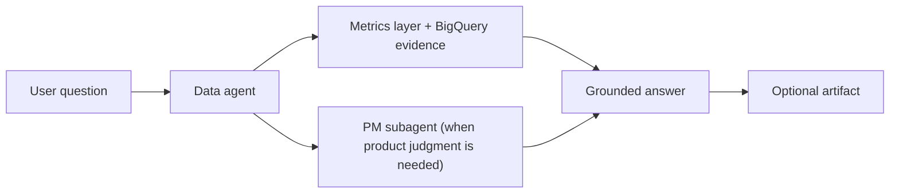
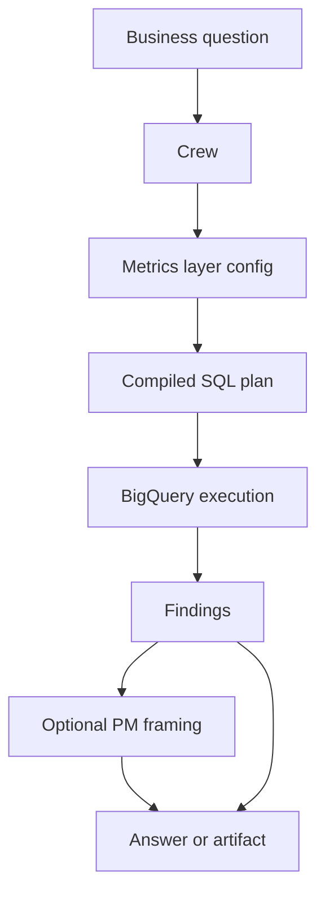

# Crew Product Capabilities

`crew` is an internal agent workspace for data, product and go-to-market teams. At a high level, it helps teams ask better questions, ground answers in trusted metrics, and turn useful outputs into reusable artifacts.

## What Crew Does

- Gives stakeholders a conversational interface for product and data questions.
- Grounds analytical answers in the `metrics_layer` instead of ad hoc warehouse logic.
- Brings in product reasoning when a request needs prioritization, trade-off analysis, or roadmap framing.
- Turns strong outputs into reusable Markdown artifacts that teams can share, revisit, and build on together.

## Core Experience

Today, `crew` works as a focused two-agent system:

- `data`: the primary agent for analytics, metrics, SQL planning, evidence gathering, and first-pass stakeholder support
- `pm`: a specialist subagent for product framing, prioritization, recommendations, and trade-off analysis

This means users do not need to know which agent to ask first. They start with one prompt, and `crew` routes to the right capability as needed.

## Why The Data Agent Matters

The `data` agent is the main way stakeholders interact with `crew`. It is designed to answer the first question most teams have: "What is happening, and what does the evidence say?"

High-level capabilities:

- Analyze product, marketing, and funnel performance through trusted metric definitions
- Translate business questions into metric selections, dimensions, filters, and SQL plans
- Investigate trends, changes, segment performance, and metric behavior
- Pull in PM support when a question shifts from analysis into prioritization or recommendation
- Turn strong findings into artifacts that can be reused across teams

## What Stakeholders Can Use It For

- Understand performance: ask about metrics, trends, cohorts, and funnel questions
- Make product decisions: bring data-backed findings into prioritization and trade-off discussions
- Create reusable outputs: turn a good session into a brief, readout, or analysis artifact
- Revisit prior work: search and read saved artifacts without rerunning the full conversation

## Example Questions Stakeholders Can Ask

- "What changed in activation over the last 4 weeks?"
- "Break down paid conversion by channel and campaign."
- "Which step in the onboarding funnel is driving the largest drop-off?"
- "How did retention move for users acquired after the new launch?"
- "What metrics should we use to evaluate this launch?"
- "Turn this analysis into a short launch readout I can share."
- "Given these results, what should we prioritize next quarter?"

## How Answers Stay Grounded

`crew` is designed to separate opinion from evidence.

- Data questions are resolved through the semantic `metrics_layer`
- Metric definitions are compiled into SQL before execution
- Product recommendations can incorporate PM reasoning, but the supporting evidence still comes from the data path

## Artifacts As A Collaboration Layer

Artifacts are how useful work in `crew` becomes reusable team knowledge.

- A good analysis can be turned into a Markdown artifact instead of staying trapped in one chat
- Teams can search, open, and reference artifacts later without recreating the work
- Product, GTM, and data stakeholders can align around the same written output
- Artifacts make it easier to share readouts, launch briefs, and analyses across functions

In practice, artifacts turn `crew` from a question-answering tool into a lightweight collaboration surface.

## Outputs Teams Can Expect

- A direct answer to the original question
- Clear evidence and analytical reasoning behind the answer
- Product framing when the question requires prioritization or a recommendation
- A reusable Markdown artifact when the output should persist beyond the chat and be shared with others

## Why This Matters

The value of `crew` is not just that it answers questions. It helps teams move from:

- raw metrics to decisions
- one-off analysis to reusable artifacts
- separate product and data conversations to a single workflow

In practice, that means faster stakeholder readouts, more consistent decision quality, and less time lost recreating work that already happened in a previous thread.
