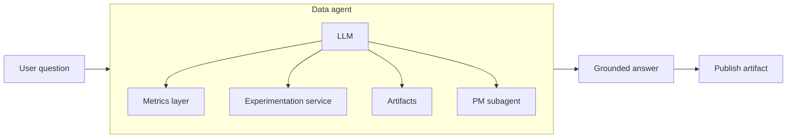
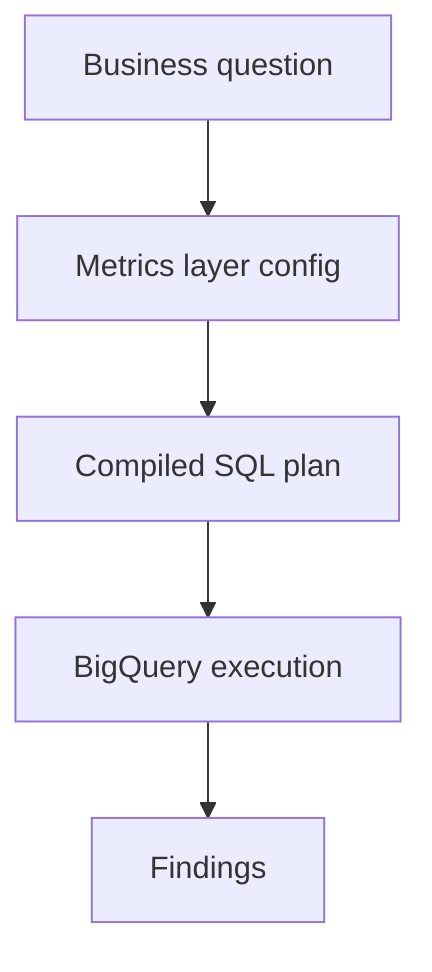
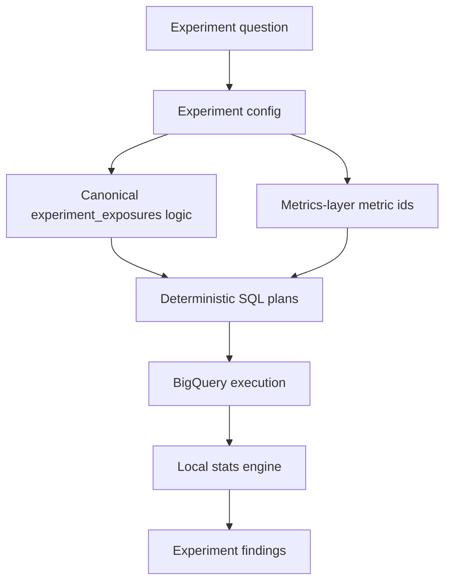

# Crew Agent

`crew` is a local agent workspace built on top of `mash`.
Its current product model is intentionally simple:

- `data` is the primary agent and main user entry point
- `pm` is a specialist subagent for product judgment
- `crew` CLI exposes both conversational workflows and direct command workflows

The goal is to help teams move from business questions to grounded answers, and from one-off answers to reusable collaborative artifacts and shared operating model. Current warehouse support is BigQuery.


## Two Ways To Use Crew

### Command Mode

Command mode is for direct, deterministic interactions with local product surfaces.
Instead of asking a free-form question, the user calls a specific CLI command.

Examples:

```bash
crew metrics list
crew metrics show --kind metric --name spend_total
crew metrics compile --metric spend_total --dimension campaign_id
crew metrics chart --metric spend_total --date-dimension start_date --grain day

crew experiment list
crew experiment show --name signup_checkout
crew experiment plan --name signup_checkout
crew experiment analyze --name signup_checkout

crew artifact list
crew artifact show launch_readout_q2
crew artifact search "launch readiness"
```

Use command mode when:

- the user knows exactly what they want to inspect
- the task is operational rather than conversational
- the user wants direct access to metric configs, experiment configs, compiled SQL, or saved artifacts


### Agent Mode

Agent mode is for free-form, conversational questions.
This is the right mode when the user wants `crew` to interpret the request, choose the right analytical path, and respond interactively.

`crew` is a focused two-agent system:

- `data`: analytics, metrics, SQL planning, evidence gathering, and first-pass stakeholder support
- `pm`: prioritization, roadmap framing, trade-off analysis, and recommendation support

Users begin with the `data` agent. When a question requires product judgment rather than just analysis, `crew` can bring in the `pm` subagent.



Examples:

```bash
crew agent repl --agent data
crew agent invoke --agent data "What changed in activation over the last 4 weeks?"
crew agent invoke --agent data "Turn this analysis into a short launch readout."
```

Use agent mode when:

- the question is open-ended
- the user wants analysis plus explanation
- the task may become a reusable artifact
- the data agent may need PM support for framing or recommendation

## Common questions

- "what changed in activation over the last 4 weeks?"
- "which step in the onboarding funnel is driving the largest drop-off?"
- "show me the results of signup_checkout_test."
- "is there any imbalance in homepage_hero_test?"
- "what metrics do we already have for the marketing dataset?"
- "turn this analysis into a short launch readout I can share."

## Context and Memory

The `data` agent is not meant to answer from intuition alone.
It is grounded by five core product layers:

- the `metrics_layer` service
- the `experimentation` service
- the `artifacts` service
- the `analyst`, `experiment-analyst`, and `steward` skills
- inbuilt `MemoryStore` layer provided by mash

Together, these give the agent a structured way to reason about business logic, reuse prior work, and keep analysis tied to durable definitions.

The memory layer is what preserves conversational context over time. Agent sessions are stored through the `MemoryStore` interface, which persists conversation turns, structured logs, signals, preferences, and app data for each session. In the current local setup, that memory is backed by SQLite, which gives the agent durable session history instead of treating every interaction as stateless.

## Metrics Layer

The `metrics_layer` is the semantic source of truth for metric and source definitions. It offers:

- stable source and metric configs
- schema-driven validation for metric authoring
- deterministic compilation from semantic metric definitions to executable SQL
- a clean contract between business logic and warehouse execution

This is what keeps the data agent grounded in config-defined business logic rather than handwritten ad hoc SQL.

In practice, the flow is:



The source contract now makes experiment joinability explicit:

- `subject`: one or more declared dimension names that tie a source back to the experiment subject
- `ts`: the canonical timestamp dimension used for post-exposure attribution and filtering

This keeps experiment analysis grounded in the same semantic source definitions as regular metric analysis.

## Experimentation Service

The `experimentation` service is the deterministic layer for experiment readouts. It offers:

- experiment configs stored under `.mash/experimentation/configs/<dataset_id>/experiments/`
- a fixed exposure-table contract backed by the BigQuery `experiment_exposures` table
- validation that experiment configs reference metrics-layer metric ids only
- deterministic SQL planning for:
  - canonical first exposures by subject and variant
  - SRM / imbalance inputs
  - post-exposure metric summary plans using metrics-layer source `subject` and `ts`
- local statistical analysis for experiment readouts after the warehouse queries return

This is what keeps experiment workflows grounded in stable config and source-of-truth exposure events instead of ad hoc joins.

In practice, the flow is:



The current experiment contract assumes:

- `experiment_exposures` is the only trusted source for assignment/exposure state
- experiment configs declare variants, control arm, subject type, and metrics
- experiment metrics must be metrics-layer metrics
- v1 automatic experiment analysis supports sources with exactly one `subject` and a declared `ts`

## Artifacts Service

The `artifacts` service is the collaboration layer for `crew`. It offers:

- durable Markdown outputs stored under `.mash/artifacts/`
- searchable prior analyses, readouts, briefs, and plans
- reusable context that the data agent can pull back into a live conversation
- a lightweight way for product, GTM, and data teams to align on the same written output

Artifacts matter because they turn a useful conversation into team knowledge instead of leaving it trapped in one session.

## Data-Agent Skills

The data agent relies on three skills:

### `analyst`

For metric-backed analysis using metrics-layer definitions and compiled SQL.

### `experiment-analyst`

For experiment readouts grounded in experiment configs, `experiment_exposures`, and metrics-layer metric ids.

### `steward`

For schema-driven, approval-gated source and metric config authoring.
