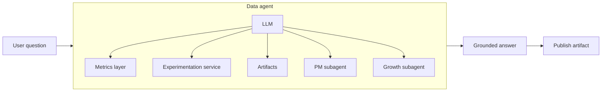
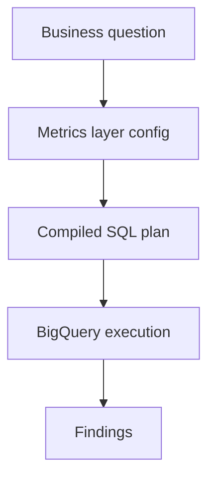
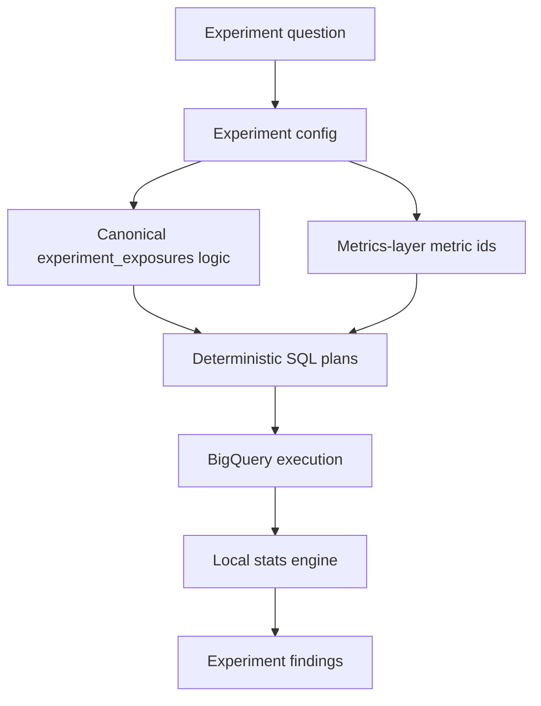
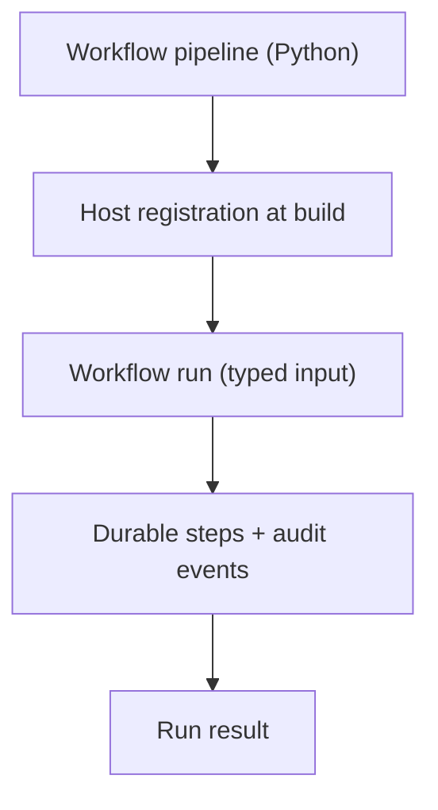

# Crew Agent

`crew` is an agent workspace built on top of `mash`.
Its product model is intentionally small:

- `data` is the primary agent and main user entry point
- `pm` and `growth` are specialist subagents
- workflows run the repeatable work that shouldn't depend on a conversation
- the `crew` CLI and the web UI are two front doors onto the same sessions

The goal is to help teams move from business questions to grounded answers, from one-off
answers to reusable artifacts, and from reusable artifacts to durable workflows that run on
their own. Current warehouse support is BigQuery.

## Workspaces

Everything in crew is scoped to a **workspace** — a named bundle of semantic configs,
experiment configs, and artifacts for one body of data:

```
workspace/<name>/
  metrics_layer/configs/{sources,metrics}/
  experimentation/configs/experiments/
  artifacts/
```

Pick one with `crew workspace show` / `crew workspace list`, or override per command with
`--workspace <name>`. The shipped workspaces are `marketing_db`, `product_usage_db`, and
`crm_db`.

## Three Ways To Use Crew

### Command Mode

Command mode is for direct, deterministic interactions with local product surfaces.
Instead of asking a free-form question, the user calls a specific CLI command.

```bash
crew metrics list
crew metrics show --kind metric --name spend_total
crew metrics compile --metric spend_total --dimension campaign_id
crew metrics chart --metric spend_total --date-dimension start_date --grain day

crew experiment list
crew experiment show --name signup_checkout
crew experiment plan --name signup_checkout
crew experiment analyze --name signup_checkout

crew artifact list
crew artifact show launch_readout_q2
crew artifact search "launch readiness"
```

Use command mode when:

- the user knows exactly what they want to inspect
- the task is operational rather than conversational
- the user wants direct access to metric configs, experiment configs, compiled SQL, or saved artifacts

### Agent Mode

Agent mode is for free-form, conversational questions — when the user wants `crew` to
interpret the request, choose the analytical path, and respond interactively.

```bash
crew login
crew repl                        # chat in an authenticated session
crew repl --session-id <id>      # resume where you left off
crew browse                      # see the agent pool, workflows, and your hosts
```

Sessions are shared with the web UI, so a conversation started in the terminal can be
picked up in the browser and vice versa. `crew sessions` lists them.

Users begin with the `data` agent. When a question needs product judgment or growth
judgment rather than analysis alone, `data` brings in a subagent:

- `data`: analytics, metrics, SQL planning, evidence gathering, first-pass stakeholder support
- `pm`: prioritization, roadmap framing, trade-off analysis, recommendation support
- `growth`: retention and expansion judgment — reading a usage trajectory against company
  context to decide what a change in consumption actually means


```mermaid
flowchart LR
    U["User question"] --> D
    D --> O["Grounded answer"]
    O --> PA["Publish artifact"]

    subgraph D["Data agent"]
        MD["LLM"]
        ML["Metrics layer"]
        E["Experimentation service"]
        A["Artifacts"]
        P["PM subagent"]
        G["Growth subagent"]
        MD --> ML
        MD --> E
        MD --> A
        MD --> P
        MD --> G
    end
```

Use agent mode when the question is open-ended, the user wants analysis plus explanation,
the task may become a reusable artifact, or the data agent needs support for framing.

### Workflow Mode

Workflow mode is for work that should run the same way every time, on a schedule or on
demand, without a human driving each step.

```bash
crew workflow list
crew workflow run consumption-dip-who --input '{"as_of_date":"2026-05-29"}'
crew workflow status consumption-dip-rescue <run_id>
```

Use workflow mode when the task is recurring, the output must be auditable, or the result
needs to be written back to a system of record rather than read in a chat.

## Common questions

- "what changed in activation over the last 4 weeks?"
- "which step in the onboarding funnel is driving the largest drop-off?"
- "show me the results of signup_checkout_test."
- "is there any imbalance in homepage_hero_test?"
- "what metrics do we already have for the marketing dataset?"
- "turn this analysis into a short launch readout I can share."

## Context and Memory

The `data` agent is not meant to answer from intuition alone.
It is grounded by several product layers:

- the `metrics_layer` service
- the `experimentation` service
- the `artifacts` service
- the `analyst`, `experiment-analyst`, and `steward` skills
- a company-context layer under `src/crew/context/{company,marketing,sales}/`, describing
  the business model, personas and tiers, product surfaces, and revenue strategy
- the inbuilt `MemoryStore` layer provided by mash

Together these give the agent a structured way to reason about business logic, reuse prior
work, and keep analysis tied to durable definitions. The company-context layer is what lets
an agent interpret a number rather than merely report it.

The memory layer preserves conversational context over time. Agent sessions persist through
the `MemoryStore` interface — conversation turns, structured logs, signals, preferences, and
per-session app data — backed by Postgres, so the agent has durable session history instead
of treating every interaction as stateless.

## Metrics Layer

The `metrics_layer` is the semantic source of truth for metric and source definitions. It
is a **read model**: it compiles definitions to SQL and reads results. Writes are not part
of this layer, and the agent-facing warehouse tool is `execute_sql_readonly`.

It offers:

- stable source and metric configs
- schema-driven validation for metric authoring
- deterministic compilation from semantic definitions to executable SQL
- a clean contract between business logic and warehouse execution

Metrics come in three shapes:

- **simple** — an expression aggregated over a source
- **windowed** — an aggregate over a window defined relative to a runtime anchor parameter,
  which is what makes "the 28 days ending on the anchor day" and "the 28 days before that"
  expressible as reusable definitions rather than hand-rolled SQL
- **ratio** — a division of two expressions or metrics

Alongside metric aggregations, the layer supports **entity reads** — non-aggregated record
lookups — because not every question is a number. Query time adds multiple measures in one
read, typed parameters, date ranges, `HAVING` filters, ordering and limits, and dimensions
pulled across a declared join.

In practice, the flow is:


```mermaid
flowchart TD
    Q["Business question"] --> M["Metrics layer config"]
    M --> SQL["Compiled SQL plan"]
    SQL --> BQ["BigQuery execution"]
    BQ --> F["Findings"]
```

The source contract also makes experiment joinability explicit:

- `subject`: one or more declared dimension names that tie a source back to the experiment subject
- `ts`: the canonical timestamp dimension used for post-exposure attribution and filtering

This keeps experiment analysis grounded in the same semantic source definitions as regular
metric analysis.

Authoring reference: `docs/semantic-layer-guide.md`.

## Experimentation Service

The `experimentation` service is the deterministic layer for experiment readouts. It offers:

- experiment configs stored under `workspace/<name>/experimentation/configs/experiments/`
- a fixed exposure-table contract backed by the BigQuery `experiment_exposures` table
- validation that experiment configs reference metrics-layer metric ids only
- deterministic SQL planning for:
  - canonical first exposures by subject and variant
  - SRM / imbalance inputs
  - post-exposure metric summary plans using metrics-layer source `subject` and `ts`
- local statistical analysis for experiment readouts after the warehouse queries return

This keeps experiment workflows grounded in stable config and source-of-truth exposure
events instead of ad hoc joins.


```mermaid
flowchart TD
    Q["Experiment question"] --> C["Experiment config"]
    C --> X["Canonical experiment_exposures logic"]
    C --> M["Metrics-layer metric ids"]
    X --> SQL["Deterministic SQL plans"]
    M --> SQL
    SQL --> BQ["BigQuery execution"]
    BQ --> S["Local stats engine"]
    S --> F["Experiment findings"]
```

The current experiment contract assumes:

- `experiment_exposures` is the only trusted source for assignment/exposure state
- experiment configs declare variants, control arm, subject type, and metrics
- experiment metrics must be metrics-layer metrics
- v1 automatic experiment analysis supports sources with exactly one `subject` and a declared `ts`

## Artifacts Service

The `artifacts` service is the collaboration layer for `crew`. It offers:

- durable Markdown outputs stored under `workspace/<name>/artifacts/`
- searchable prior analyses, readouts, briefs, and plans
- reusable context that the data agent can pull back into a live conversation
- a lightweight way for product, GTM, and data teams to align on the same written output

Artifacts matter because they turn a useful conversation into team knowledge instead of
leaving it trapped in one session.

## Workflows

Workflows are code-shipped, typed step pipelines (`CodeStep` / `AgentStep`) registered with
the Mash runtime at host build. The runtime owns definitions, durable runs, step-level audit
events, and resume-from-failed-step; crew exposes thin command and API surfaces for listing
workflows, configuring inputs, starting runs, and inspecting them. Every host includes the
built-in masher suite (trace digests, online eval curation, synthetic eval generation,
experiment runs).


```mermaid
flowchart TD
    D["Workflow pipeline (Python)"] --> R["Host registration at build"]
    R --> X["Workflow run (typed input)"]
    X --> S["Durable steps + audit events"]
    S --> F["Run result"]
```

Each step is one of two kinds. A deterministic step is `code`; a reasoning step is `agent`.
Code steps are the read/write seams onto your stack — the queries, the gating, the writes
back to the system of record. Agent steps do the reasoning in between.

## Own your net revenue retention

For a consumption dev tool, revenue **is** usage — and it leaks silently, with no
cancellation event to catch. Crew runs always-on workflows that stop the leak and drive the
expansion, on top of the stack you already have.

The goal metric is **net revenue retention**: installed-base consumption this period ÷ last.
Two workflows own the two halves of it.

Every workflow holds out a control arm, so the readout shows the number moved — not that
emails were sent.

### Workflow 1a — Consumption Dip Rescue

Daily. Stops the leak. A consumption tool has no cancel event, so a code step manufactures
the signal and the crew acts before the revenue is gone.

| Step | Kind | Touches | What it does |
|---|---|---|---|
| `pull-usage-panel` | code | warehouse | Per-org token series + 4-week rolling baseline. Pure query. |
| `score-and-gate` | code | CRM | Decay % vs. own baseline, sustained days, revenue-weight → segment; dedupe against open plays. Fixed formula. |
| `diagnose-dip` | agent | | Which surface dropped, one power user leaving vs. broad decay, root-cause hypothesis. Judgment over targeted SQL. |
| `select-and-draft-play` | agent | engagement ctx | Choose the motion by segment + tier and draft the personalized copy. |
| `assign-and-deliver` | code | CRM, engagement | Holdout split, deliver, write play + outcome back to the account. Idempotent, checkpointed. |

### Workflow 1b — Expansion / PQA Engine

Weekly. Drives the expansion. Internal usage says *who is growing*; company signal says *how
big the ceiling is* and whether now is the moment. The agent fuses them.

| Step | Kind | Touches | What it does |
|---|---|---|---|
| `compute-expansion-signals` | code | warehouse | Token slope, active-dev growth, new surface adoption per org → raw PQA score. Deterministic. |
| `resolve-and-enrich-company` | code | enrichment | Org → domain, then headcount, funding stage, hiring signals, tech stack. Read-only, idempotent by domain. |
| `build-expansion-thesis` | agent | | Usage trajectory × company headroom × timing → motion, TAM estimate, confidence. Pure fused reasoning. |
| `personalize-play` | agent | | Self-serve upgrade nudge vs. sales briefing with usage evidence and company context attached. |
| `route-and-record` | code | CRM, engagement | Holdout split, write PQA + thesis to the record, route the briefing to the rep, dedupe vs. open opps. |

### Why the agent step is load-bearing

Same org, same warehouse row: 3 → 9 active devs, tokens +140%. In a 12-person startup that
is a ceiling — nudge to self-serve. In a 4,000-person enterprise that just raised, nine devs
is a beachhead worth a human motion **this week**. Code fetches the signal; the agent decides
what it means.

### Previewing a run

Each workflow ships a read-only companion — `consumption-dip-who` and `expansion-pqa-who` —
that runs only the deterministic candidate steps. No agent, no writes. They reuse the parent
workflows' own code-step closures, so the set they show is the set the parent would act on,
identical by construction rather than by convention.

```bash
crew workflow list
crew workflow run consumption-dip-who --input '{"as_of_date":"2026-05-29"}'
crew workflow status consumption-dip-rescue <run_id>
```

Both parent workflows stop before real outbound. The deliverable is a play and a thesis
written to the system of record, staged for a human to send.

### Readouts

Each workflow has a paired weekly readout: for dip rescue, $ at-risk → $ rescued → lift vs.
holdout → gross retention; for expansion, pipeline generated → converted → incremental
consumption → NRR contribution. Holdout arms are assigned and recorded on every run, so the
readout is computed from real control data rather than asserted.

### Running on your stack

Each tool plugs in as a context provider, an actuator, or both, and Crew orchestrates across
them — no rip-and-replace:

- **Warehouse** — product signal, read. Usage trajectory, decay, expansion: tokens,
  surfaces, active devs per org.
- **Enrichment** — company signal, read. Firmographics, funding, hiring, tech stack: how big
  the ceiling is and whether now is the moment.
- **CRM** — system of record, read + write. The account truth, maintained by Crew: play
  history, thesis, outcomes, deduped with history preserved.
- **Engagement** — read + actuate. Prior-touch context in; outbound and rep briefings out.

Every tool registers as an MCP-style provider. The code steps are where those seams live.

## Agent Skills

### Data agent

- **`analyst`** — metric-backed analysis using metrics-layer definitions and compiled SQL
- **`experiment-analyst`** — experiment readouts grounded in experiment configs,
  `experiment_exposures`, and metrics-layer metric ids
- **`steward`** — schema-driven, approval-gated source and metric config authoring

### Growth agent

- **`diagnosing-consumption-dips`** — which surface dropped, whether it is one power user
  leaving or broad decay, and the likely root cause
- **`building-expansion-thesis`** — fusing usage trajectory, company headroom, and timing
  into a motion, TAM estimate, and confidence
- **`selecting-nrr-plays`** — choosing the motion that fits the segment and tier, and
  drafting the copy
