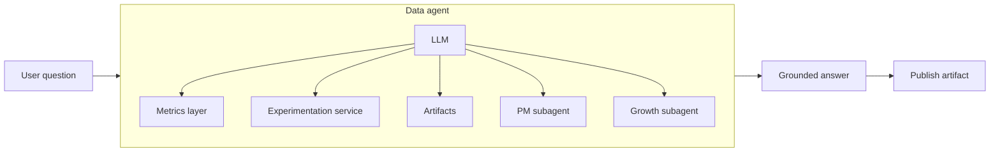
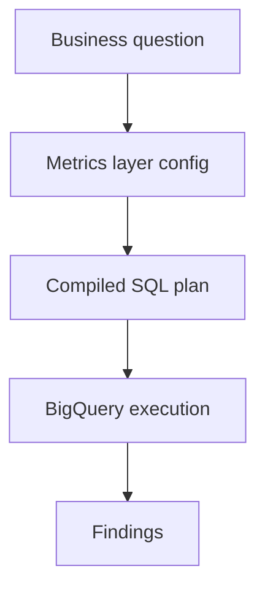
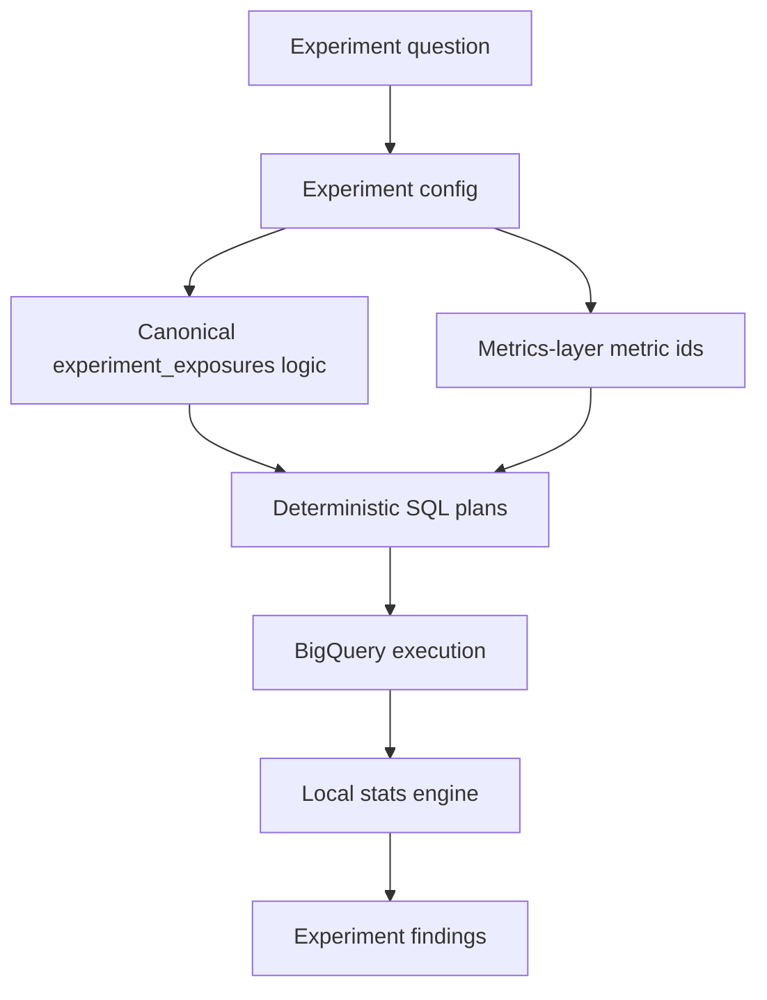

# Crew Agent

`crew` is an agent workspace built on top of `mash` consisting of:
- `data` is the primary agent and main user entry point
- `pm` and `growth` are specialist subagents
- deterministic `workflows` for driving NRR
- the `crew` CLI and the web UI are two front doors onto the same sessions

The goal is to help teams answer business questions with grounded answers, publish artifacts for humans and agents to collaborate,
and run deterministic workflows.

## Workspaces

Everything in crew is scoped to a **workspace** — a named bundle of semantic configs,
experiment configs, and artifacts for one body of data:

```
workspace/<name>/
  metrics_layer/configs/{sources,metrics}/
  experimentation/configs/experiments/
  artifacts/
```

## Three Ways To Use Crew

### Command Mode

Command mode is for direct, deterministic interactions with local product surfaces.
Instead of asking a free-form question, the user calls a specific CLI command.

```bash
crew metrics list
crew metrics show --kind metric --name spend_total
crew metrics compile --metric spend_total --dimension campaign_id
crew metrics chart --metric spend_total --date-dimension start_date --grain day

crew experiment list
crew experiment show --name signup_checkout
crew experiment plan --name signup_checkout
crew experiment analyze --name signup_checkout

crew artifact list
crew artifact show launch_readout_q2
crew artifact search "launch readiness"
```

Use command mode when:

- the user knows exactly what they want to inspect
- the task is operational rather than conversational
- the user wants direct access to metric configs, experiment configs, compiled SQL, or saved artifacts

### Agent Mode

Agent mode is for free-form, conversational questions — when the user wants `crew` to
interpret the request, choose the analytical path, and respond interactively.

```bash
crew login
crew repl                        # chat in an authenticated session
crew repl --session-id <id>      # resume where you left off
crew browse                      # see the agent pool, workflows, and your hosts
```

Sessions are shared with the web UI, so a conversation started in the terminal can be
picked up in the browser and vice versa. `crew sessions` lists them.

Users begin with the `data` agent. When a question needs product judgment or growth
judgment rather than analysis alone, `data` brings in a subagent:

- `data`: analytics, metrics, SQL planning, evidence gathering, first-pass stakeholder support
- `pm`: prioritization, roadmap framing, trade-off analysis, recommendation support
- `growth`: retention and expansion judgment — reading a usage trajectory against company
  context to decide what a change in consumption actually means


```mermaid
flowchart LR
    U["User question"] --> D
    D --> O["Grounded answer"]
    O --> PA["Publish artifact"]

    subgraph D["Data agent"]
        MD["LLM"]
        ML["Metrics layer"]
        E["Experimentation service"]
        A["Artifacts"]
        P["PM subagent"]
        G["Growth subagent"]
        MD --> ML
        MD --> E
        MD --> A
        MD --> P
        MD --> G
    end
```

Use agent mode when the question is open-ended, the user wants analysis plus explanation,
the task may become a reusable artifact, or the data agent needs support for framing.

## Common questions

- "what changed in activation over the last 4 weeks?"
- "which step in the onboarding funnel is driving the largest drop-off?"
- "show me the results of signup_checkout_test."
- "is there any imbalance in homepage_hero_test?"
- "what metrics do we already have for the marketing dataset?"
- "turn this analysis into a short launch readout I can share."

### Workflow Mode

Workflow mode is for work that should run the same way every time, on a schedule or on
demand, without a human driving each step.

```bash
crew workflow list
crew workflow run consumption-dip --input '{"as_of_date":"2026-05-29"}'
crew workflow status consumption-dip <run_id>
```

Use workflow mode when the task is recurring, the output must be auditable, or the result
needs to be written back to a system of record rather than read in a chat.


## Context and Memory

The `data` agent is grounded on the following services:

- the `metrics_layer` service
- the `experimentation` service
- the `artifacts` service
- the `analyst`, `experiment-analyst`, and `steward` skills
- a company-context layer under `src/crew/context/{company,marketing,sales}/`, describing
  the business model, personas and tiers, product surfaces, and revenue strategy
- persistent `MemoryStore` layer provided by mash

Together these give the agent a structured way to reason about business logic, reuse prior
work, and keep analysis tied to durable definitions.

### SKILLs

The data agent works through `analyst` SKILL for metric-backed analysis against compiled SQL, 
and `experiment-analyst` for readouts tied to exposure data, 
and `steward` for approval-gated changes to the metric definitions. The
growth agent has SKILLs for diagnosing consumption dip, building an expansion thesis,
and choosing the outbound play that are used inside the NRR workflows below.

The memory layer preserves conversational context over time. Agent sessions persist through
the `MemoryStore` interface — conversation turns, structured logs, signals, preferences, and
per-session app data — backed by Postgres, so the agent has durable session history instead
of treating every interaction as stateless.

## Metrics Layer

The `metrics_layer` is the semantic source of truth for metric and source definitions. It
is a **read model**: it compiles definitions to SQL and reads results. Writes are not part
of this layer, and the agent-facing warehouse tool is `execute_sql_readonly`.

It offers:

- stable source and metric configs
- schema-driven validation for metric authoring
- deterministic compilation from semantic definitions to executable SQL
- a clean contract between business logic and warehouse execution

Metrics come in three shapes:

- **simple** — an expression aggregated over a source
- **windowed** — an aggregate over a window defined relative to a runtime anchor parameter,
  which is what makes "the 28 days ending on the anchor day" and "the 28 days before that"
  expressible as reusable definitions rather than hand-rolled SQL
- **ratio** — a division of two expressions or metrics

Alongside metric aggregations, the layer supports **entity reads** — non-aggregated record
lookups — because not every question is a number. Query time adds multiple measures in one
read, typed parameters, date ranges, `HAVING` filters, ordering and limits, and dimensions
pulled across a declared join.

In practice, the flow is:


```mermaid
flowchart TD
    Q["Business question"] --> M["Metrics layer config"]
    M --> SQL["Compiled SQL plan"]
    SQL --> BQ["BigQuery execution"]
    BQ --> F["Findings"]
```

The source contract also makes experiment joinability explicit:

- `subject`: one or more declared dimension names that tie a source back to the experiment subject
- `ts`: the canonical timestamp dimension used for post-exposure attribution and filtering

This keeps experiment analysis grounded in the same semantic source definitions as regular
metric analysis.

Authoring reference: `docs/semantic-layer-guide.md`.

## Experimentation Analysis Service

The `experimentation` service is the deterministic layer for experiment readouts. It offers:

- experiment configs stored under `workspace/<name>/experimentation/configs/experiments/`
- a fixed exposure-table contract backed by the BigQuery `experiment_exposures` table
- validation that experiment configs reference metrics-layer metric ids only
- deterministic SQL planning for:
  - canonical first exposures by subject and variant
  - SRM / imbalance inputs
  - post-exposure metric summary plans using metrics-layer source `subject` and `ts`
- local statistical analysis for experiment readouts after the warehouse queries return

This keeps experiment workflows grounded in stable config and source-of-truth exposure
events instead of ad hoc joins.


```mermaid
flowchart TD
    Q["Experiment question"] --> C["Experiment config"]
    C --> X["Canonical experiment_exposures logic"]
    C --> M["Metrics-layer metric ids"]
    X --> SQL["Deterministic SQL plans"]
    M --> SQL
    SQL --> BQ["BigQuery execution"]
    BQ --> S["Local stats engine"]
    S --> F["Experiment findings"]
```

The current experiment contract assumes:

- `experiment_exposures` is the only trusted source for assignment/exposure state
- experiment configs declare variants, control arm, subject type, and metrics
- experiment metrics must be metrics-layer metrics
- v1 automatic experiment analysis supports sources with exactly one `subject` and a declared `ts`

## Artifacts Service

The `artifacts` service is the collaboration layer for `crew`. It offers:

- durable Markdown outputs stored under `workspace/<name>/artifacts/`
- searchable prior analyses, readouts, briefs, and plans
- reusable context that the data agent can pull back into a live conversation
- a lightweight way for product, GTM, and data teams to align on the same written output

Artifacts matter because they turn a useful conversation into team knowledge instead of
leaving it trapped in one session.

## Growth Workflow: Net Revenue Retention

Crew ships two deterministic workflows focused on Net Reveue Retention (NRR) for any consumption business by integrating with an existing GTM stack via MCP:

| | Role | What Crew uses it for |
|---|---|---|
| **Warehouse** | Product signal · read | Tokens, surfaces, and active devs per org; usage trajectory and decay. |
| **Signals** | Company signal · read | Firmographics, funding stage, hiring signals, tech stack. |
| **CRM** | System of record · read + write | Reads open plays and opportunities for dedupe; writes back thesis, play, and outcome. |
| **Outbound** | Engagement · read + actuate | Reads prior touches; delivers outbound and rep briefings. |


### Workflow 1: Consumption Dip Rescue

Runs daily. Catches accounts whose consumption is falling.

Crew compares each org's token trajectory against that org's own rolling baseline, weights
the decay by revenue, and drops accounts that already have a play in flight.

For each account that passes, it identifies which surface dropped and whether the cause is
one power user leaving or broad decay across the team, picks the motion for that segment and
tier, and drafts the copy against the account's usage evidence and prior touches.

Output: a rescue play on the account, with the outcome written back to the CRM.

### Workflow 2: Expansion / PQA Engine

Runs weekly. Catches accounts whose consumption is rising.

Crew scores accounts on token slope, active-developer growth, and new surface adoption,
resolves each org to a company, and pulls headcount, funding stage, hiring signals, and tech
stack. It combines usage and company signal into a thesis: which motion to run, the size of
the opportunity, and a confidence level.

Company size is what separates the two motions. 3 → 9 active devs with tokens up 140% is
near the ceiling in a 12-person startup, so the play is a self-serve upgrade nudge. The same
delta in a 4,000-person enterprise that just raised is a small fraction of the account, so
the play is a sales briefing.

Output: a self-serve nudge or a rep briefing, with the usage evidence and company context
attached, deduped against open opportunities.

### Preview before it acts

Each workflow has a read-only twin that runs the account selection and stops — no reasoning
steps, no outreach, no writes. It returns the same account list the full workflow would act
on, so you can review it first.

Neither workflow sends outbound on its own. The play is staged for a human to send.

### The readouts

Each workflow has a paired weekly readout:

- **Dip rescue** — $ at-risk → $ rescued → lift vs. holdout → gross retention.
- **Expansion** — pipeline generated → converted → incremental consumption → NRR
  contribution.

The holdout arm is assigned on every run, so lift is computed from control data rather than
estimated.