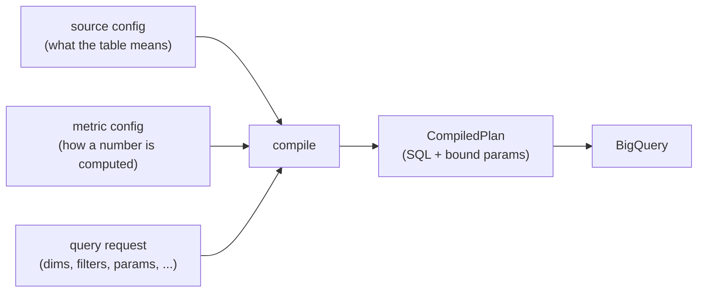

# Semantic Layer — Authoring Guide

The `metrics_layer` is the semantic source of truth for how the Crew reads its
warehouse. Instead of writing SQL against BigQuery tables, you declare **sources**
(what a table means) and **metrics** (how a number is computed) as YAML config, and
the layer compiles a deterministic SQL plan on demand.

This guide is for the people who author those configs and issue queries against them.
It explains the vocabulary, the query-time features, and shows each one with a real
example from the shipped `product_usage_db` and `crm_db` workspaces. It does **not**
cover how the compiler is built — only how to use it.

> **The one rule that shapes everything:** the layer is a **read model**. It owns metric
> aggregation and record lookups. It does not own scoring, gating, or writes. If your
> logic is *set-shaped and declarative* ("group these rows, aggregate this, filter by
> that"), it belongs in config. If it's genuinely imperative (procedural scoring, a
> gaps-and-islands run, a MERGE), keep it in code around the layer.

---

## Mental model

Two config kinds, two query archetypes, one contract.



- A **source** wraps one physical table and gives its columns names, types, and roles
  (dimensions, measures, join keys, timestamp).
- A **metric** is a named computation defined *against a source* — a simple aggregate, a
  time-windowed aggregate, or a ratio.
- A **query** picks metrics (or entity attributes), grouping dimensions, filters,
  parameters, and so on. It compiles to a `CompiledPlan` and runs.

Everything below is additive and version-gated: a `version: 1` config keeps compiling
untouched as new capabilities land. New capability = new optional block, never a break.

---

## Part 1 — Sources: what a table means

A source is the foundation. Every metric points at exactly one `base_source`, and every
query resolves through it. Here is the shipped `orgs` source, annotated:

```yaml
kind: source
version: 1
id: orgs                       # stable id, referenced by metrics' base_source
dataset: product_usage_db      # logical dataset
table: dim_orgs                # physical BigQuery table
subject:                       # dimension(s) that tie rows to the experiment subject
  - org_id
ts: as_of_date                 # canonical timestamp dimension (enables windowed metrics)

dimensions:                    # non-aggregated fields: grouping, filtering, attributes
  - name: as_of_date
    expr: as_of_date
    data_type: DATE
  - name: org_id
    expr: org_id
    data_type: STRING
    is_primary_key: true
  - name: plan_tier
    expr: plan_tier
    data_type: STRING
  # A dimension can be pulled from a joined source (see Joins):
  - name: base_fee_usd
    expr: base_fee_usd
    data_type: FLOAT64
    source: plan_pricing       # this value lives on the joined `plan_pricing` source

measures:                      # aggregated building blocks for metrics
  - name: tokens_consumed_sum
    expr: tokens_consumed      # the column to aggregate
    agg: SUM                   # SUM | AVG | MIN | MAX | COUNT | COUNT_DISTINCT | ...
    data_type: INT64
  - name: active_users_sum
    expr: active_users
    agg: SUM
    data_type: INT64
  - name: active_org_count     # expr can be any SQL, not just a bare column
    expr: CASE WHEN org_state = 'active' THEN 1 ELSE 0 END
    agg: SUM
    data_type: INT64

joins:                         # optional relationships to other sources
  - to_source: plan_pricing
    join_type: LEFT
    left_key: plan_tier
    right_key: plan_tier
    relationship: many_to_one
```

### Field-by-field

| Field | Role |
|---|---|
| `id` | Stable identifier; metrics reference it via `base_source`. Match the filename stem. |
| `dataset` / `table` | Which physical BigQuery table this source wraps. |
| `subject` | Dimension name(s) that tie a row back to the experiment subject (e.g. `org_id`). Used by experiment analysis to keep it on the same definitions as metric analysis. |
| `ts` | The canonical timestamp dimension. Required if any metric on this source is `windowed`. |
| `dimensions[]` | Named, typed, non-aggregated fields. Used for `GROUP BY`, filtering, and entity attributes. `is_primary_key` marks the key; `source:` points a dimension at a joined source. |
| `measures[]` | Named aggregations (`expr` + `agg`). These are the vocabulary that simple metrics draw on. |
| `joins[]` | Declared many-to-one relationships to other sources (compiled only when a query needs them). |

**Dimensions vs. measures**, the distinction that trips people up: a *dimension* is a
value you group or filter by (`plan_tier`, `org_id`, `as_of_date`); a *measure* is a
value you aggregate (`SUM(tokens_consumed)`). A field can appear as both if you need it
both ways — declare a dimension `active_users` and a measure `active_users_sum`.

---

## Part 2 — Metrics: how a number is computed

A metric is `type: simple | windowed | ratio`, defined against one `base_source`.

### 2.1 Simple metrics

An aggregate. The `expr` can be written three ways, in order of preference:

**(a) Reference a source measure by name** — the cleanest form. The metric inherits the
measure's aggregation:

```yaml
kind: metric
version: 1
id: org_daily_tokens
label: Org Daily Tokens
type: simple
base_source: orgs
expr: tokens_consumed_sum        # resolves to SUM(tokens_consumed) from the measure
dimensions:                      # the grouping grain this metric allows
  - as_of_date
  - org_id
  - plan_tier
```

**(b) Write the aggregate inline** — when you don't want a named measure. A fully
aggregated expression is passed through verbatim:

```yaml
kind: metric
version: 1
id: avg_tokens_per_org
label: Avg Tokens Per Org
type: simple
base_source: orgs
expr: AVG(tokens_consumed)        # aggregated expression used as-is
dimensions:
  - org_name
  - plan_tier
```

**(c) A bare column** — the compiler wraps it in `SUM(...)` and emits a warning. Prefer
(a) or (b) so the aggregation is explicit.

> **`dimensions` on a metric is an allow-list.** If present, a query may only group by
> dimensions in that list. Omit it to allow any dimension the source declares.

### 2.2 Windowed metrics — time intelligence

A windowed metric aggregates over a date window defined *relative to a runtime anchor
parameter*, so period-over-period reads stay correct across dates without editing config.
It compiles to `AGG(IF(<ts in window>, <expr>, <else>))`.

```yaml
kind: metric
version: 1
id: tokens_recent_28d
label: Tokens (recent 28d)
type: windowed
base_source: orgs
expr: tokens_consumed            # value expression to aggregate
agg: SUM
window:
  anchor_param: as_of            # bound at query time (e.g. @as_of = 2026-07-18)
  lower:
    days_before: 28              # ts > as_of - 28 days
    inclusive: false
```

The `window` block accepts any of three bounds, each with `days_before` and optional
`inclusive`:

| Bound | Meaning | Compiles to |
|---|---|---|
| `equals` | ts is exactly N days before the anchor | `ts = DATE_SUB(@as_of, INTERVAL N DAY)` |
| `lower` | ts after the lower bound | `ts > / >= DATE_SUB(@as_of, INTERVAL N DAY)` |
| `upper` | ts before the upper bound | `ts < / <= DATE_SUB(@as_of, INTERVAL N DAY)` |

Combine them to name any window. The **prior** 28-day window is just an `upper` bound;
the **value at the anchor** is `equals: {days_before: 0}`:

```yaml
# The 28 days ending 28 days ago — the "prior" comparison period.
id: tokens_prior_28d
type: windowed
base_source: orgs
expr: tokens_consumed
agg: SUM
window:
  anchor_param: as_of
  upper:
    days_before: 28
    inclusive: true
```
```yaml
# Active users on the anchor day itself.
id: active_users_now
type: windowed
base_source: orgs
expr: active_users
agg: MAX
window:
  anchor_param: as_of
  equals:
    days_before: 0
```

**Else-value semantics** are chosen to match hand-written SQL: `SUM`/`COUNT` use a `0`
else so absent days don't null the total; every other aggregation (`AVG`, `MIN`, `MAX`,
…) uses `NULL` so absent days are ignored rather than dragging an average down.

> Windowed metrics require the source to declare `ts`. The anchor (`as_of`) is supplied
> at query time as a bound `DATE` parameter — see Part 3.

### 2.3 Ratio metrics

A division of two expressions. Each side may reference other metric ids by name — they
get substituted with their compiled SQL — or be a raw expression:

```yaml
kind: metric
version: 1
id: token_slope
label: Token Slope (recent vs prior)
type: ratio
base_source: orgs
numerator: tokens_recent_28d - tokens_prior_28d   # metric ids, substituted inline
denominator: tokens_prior_28d
```

This composes over the two windowed metrics above and compiles to
`SAFE_DIVIDE((recent - prior), (prior))` — division-by-zero yields `NULL`, not an error.
Ratios can reference simple or windowed metrics, and ratios of ratios are allowed
(cycles are detected and rejected).

### Metric field reference

| Field | Applies to | Meaning |
|---|---|---|
| `type` | all | `simple`, `windowed`, or `ratio`. |
| `base_source` | all | The source this metric is defined against. |
| `expr` | simple, windowed | Aggregate expression (simple) or value expression to aggregate (windowed). |
| `agg` | windowed | Aggregation applied to the windowed value (`SUM`, `AVG`, `MAX`, …). |
| `window` | windowed | `anchor_param` + any of `equals`/`lower`/`upper`. |
| `numerator` / `denominator` | ratio | Expressions or metric ids to divide. |
| `dimensions` | simple | Optional allow-list of grouping dimensions. |
| `filters` | simple | Optional filter expressions baked into the metric. |
| `format` | all | Display hint (e.g. `0.00%`, `$#,##0.00`). |

---

## Part 3 — Query-time features

Sources and metrics are static definitions; a **query** is where you assemble them.
Queries are issued two ways — by the data agent through the `compile_*` tools, and by
workflow code through the in-process runtime (`compile_and_run` / `read_entity`). Both
paths share the same options. The examples below show the runtime form; the agent tools
take the same fields as JSON args.

### 3.1 Multiple measures in one read

Request several metrics that share a `base_source` and they compile to **one** SELECT,
each metric its own value column at the shared grain — no client-side zip:

```python
series = ctx.compile_and_run_multi(
    "product_usage_db",
    ["org_daily_tokens", "org_daily_active_users"],   # two value columns, one query
    dimensions=["as_of_date", "org_id", "plan_tier"],
    date_range={"dimension": "as_of_date", "start": start, "end": as_of_date},
    limit=1000,
)
# each row: {as_of_date, org_id, plan_tier, org_daily_tokens, org_daily_active_users}
```

All requested metrics must share the same `base_source`.

### 3.2 Typed parameters

Declare typed inputs and bind them at call time instead of string-inlining values. This
is what makes dynamic `IN`-lists and reusable anchors safe. Filters reference params by
`@name`:

```python
rows = ctx.compile_and_run(
    "crm_db",
    "open_plays_by_org",
    dimensions=["org_id"],
    filters=[
        "status IN UNNEST(@open_statuses)",
        "org_id IN UNNEST(@org_ids)",
    ],
    parameters=[
        BindParam("open_statuses", "ARRAY<STRING>", ["ready_to_send", "briefing_ready"]),
        BindParam("org_ids", "ARRAY<STRING>", ids),
    ],
)
```

Supported types include `DATE`, `STRING`, `INT64`, `FLOAT64`, `BOOL`, and
`ARRAY<STRING>` (and other `ARRAY<...>`). A windowed metric's anchor is just a `DATE`
param:

```python
parameters=[BindParam("as_of", "DATE", as_of)]   # binds @as_of used by window bounds
```

**Two execution paths, one plan.** In-process callers bind real BigQuery named
parameters. The agent path (`execute_sql_readonly`, which takes only a SQL string)
receives the same plan with every `@param` rendered back to a safe literal. You author
once; the layer handles both.

### 3.3 Date ranges

`date_range` bounds a scan on a date dimension. It desugars to bound `DATE` parameters
automatically — you just give a dimension and ISO dates:

```python
date_range={"dimension": "as_of_date", "start": "2026-05-01", "end": "2026-07-18"}
# -> WHERE DATE(as_of_date) >= @p_as_of_date_start AND DATE(as_of_date) <= @p_as_of_date_end
```

### 3.4 HAVING — post-aggregation filters

Filter on the aggregated result, after `GROUP BY`. Use it when the predicate is about
the *measure*, not the row:

```python
surface_rows = ctx.compile_and_run_multi(
    "product_usage_db",
    ["surface_first_seen"],                      # MIN(activity_date) per group
    dimensions=["org_id", "product_surface"],
    having=["surface_first_seen > DATE_SUB(@as_of, INTERVAL 75 DAY)"],
    parameters=[BindParam("as_of", "DATE", as_of)],
    limit=1000,
)
```

`filters` become `WHERE` (pre-aggregation, on raw rows); `having` becomes `HAVING`
(post-aggregation, on measures/metrics). Params work in both.

### 3.5 Ordering and limits

```python
order_by=[{"field": "org_id", "direction": "ASC"},
          {"field": "as_of_date", "direction": "ASC"}],
limit=1000,   # 1..1000, defaults to 100
```

`order_by` fields must be a selected dimension or value column.

---

## Part 4 — Joins: pulling attributes across sources

Declare a many-to-one `join` on the base source, then any dimension whose value lives on
the joined ("one") side carries a `source:` pointer. The join is compiled **only when a
query actually requests such a dimension** — single-source queries stay join-free.

In `orgs`, the base-fee and price columns live on `plan_pricing`:

```yaml
# orgs source
dimensions:
  - name: base_fee_usd
    expr: base_fee_usd
    data_type: FLOAT64
    source: plan_pricing          # ← reads from the joined source
joins:
  - to_source: plan_pricing
    join_type: LEFT
    left_key: plan_tier
    right_key: plan_tier
    relationship: many_to_one     # only many_to_one is supported (fan-out safety)
```

Now a single usage read folds the plan's pricing in — no Python-side dict merge:

```python
ctx.compile_and_run_multi(
    "product_usage_db",
    ["org_daily_tokens", "org_daily_active_users"],
    dimensions=["as_of_date", "org_id", "plan_tier",
                "base_fee_usd", "per_million_tokens_usd"],  # ← joined attributes
    ...
)
```

Only `many_to_one` joins are allowed, and only attributes/measures from the *one* side
may be pulled — this is deliberate, to prevent double-counting on the many side.

---

## Part 5 — Entity reads: not everything is a metric

Sometimes you want *records*, not aggregates — "give me the account row for these org
ids." That's the **entity-read** archetype: a projection of declared dimensions filtered
by key, with no `GROUP BY`. It reuses the exact same source vocabulary.

```python
rows = ctx.read_entity(
    "crm_db",
    "accounts",
    attributes=[
        "org_id", "account_name", "domain", "owner",
        "segment", "plan_tier", "consumption_mrr", "thesis",
    ],
    filters=["org_id IN UNNEST(@org_ids)"],
    parameters=[BindParam("org_ids", "ARRAY<STRING>", ids)],
)
```

The agent equivalent is the `compile_entity_read_to_sql` tool (`source`, `attributes`,
`filters`, `parameters`, `order_by`, `limit`). Entity reads honor the same joins, so you
can project an attribute from a joined source in a record lookup too.

Use an entity read when you want raw rows keyed by id; use a metric query when you want
an aggregate at a grain.

---

## Part 6 — Authoring workflow

1. **Model the source first.** Name the table's dimensions and measures, mark the primary
   key, set `subject`, and set `ts` if you'll want windowed metrics. Declare joins to any
   source you'll pull attributes from.
2. **Define metrics against it.** Prefer referencing named measures. Reach for `windowed`
   when the number is period-relative and `ratio` when it's a comparison.
3. **Validate before writing.** Configs are schema-validated (`source.schema.yml` /
   `metric.schema.yml`) *and* semantically checked before they're accepted — unknown
   fields, missing requireds, and dangling references are rejected at write time. The
   `steward` skill drives this authoring loop with approval gating.
4. **Query and iterate.** Compile with `compile_metric_configs_to_sql` (aggregations) or
   `compile_entity_read_to_sql` (record lookups), inspect the SQL, then execute it. The
   two-step compile→execute contract keeps the agent grounded in config-defined logic
   rather than ad-hoc SQL.

### What stays out of config

By design, the layer stops at what is declarative. Keep these in the code around it:

- **Writes** — MERGE/UPDATE live in a sibling typed write repo, never compiled by the
  read layer.
- **Procedural logic** — scoring, gating, segmentation, a sustained-day gaps-and-islands
  run. If it's a loop with branches, it's not a metric.
- **Many-to-many joins** — only many-to-one is in scope.

---

## Quick reference

| I want to… | Use |
|---|---|
| Sum/average a column at a grain | `simple` metric referencing a measure |
| Compare a recent window to a prior one | two `windowed` metrics + a `ratio` |
| A value as of a specific day | `windowed` with `equals: {days_before: 0}` |
| Several numbers at one grain in one query | `compile_and_run_multi` / multiple `metric_names` |
| A safe dynamic `IN`-list | `ARRAY<STRING>` parameter + `IN UNNEST(@p)` |
| Filter raw rows before aggregating | `filters` (→ `WHERE`) |
| Filter on an aggregated value | `having` (→ `HAVING`) |
| Pull an attribute from another table | `join` + a dimension with `source:` |
| Fetch records by key (no aggregation) | entity read (`read_entity` / `compile_entity_read_to_sql`) |
</content>
</invoke>
